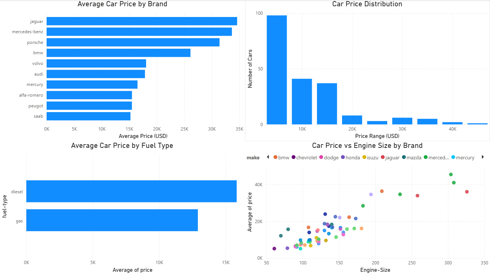

# Used Car Price Analysis

## Project Overview

This project analyzes factors influencing used car prices using Python.  
The objective is to explore relationships between vehicle characteristics and price through:

- Data cleaning
- Exploratory Data Analysis (EDA)
- Feature engineering
- Predictive modeling
- Model evaluation and refinement

The dataset comes from IBM Skills Network and contains technical specifications and prices of used cars.

---

## Dataset

- Source: IBM Skills Network  
- Rows: 205  
- Columns: 26  
- Target variable: `price`

---

## Data Cleaning

The following preprocessing steps were performed:

- Replaced `"?"` values with `NaN`
- Converted selected columns to numeric types
- Removed rows with missing target (`price`)
- Filled missing values:
  - Median for `normalized-losses`
  - Mean for numerical features (`bore`, `stroke`, `horsepower`, `peak-rpm`)
  - Mode for `num-of-doors`
- Verified data types and missing values after cleaning

---

## Exploratory Data Analysis (EDA)

### Correlation Analysis

A correlation matrix was used to identify variables most strongly related to price.

**Top positive correlations:**
- Engine size  
- Curb weight  
- Horsepower  
- Vehicle width  

**Negative correlations:**
- City MPG  
- Highway MPG  

### Visualizations

- Engine size vs Price (strong positive linear trend)
- Horsepower vs Price (clear positive relationship)
- Price vs Drive Wheels (RWD vehicles tend to be more expensive)
- Price vs Body Style (convertibles and hardtops show higher prices)

---

## Model Development

The modeling phase focused on predicting car prices using both numerical and categorical features.

### Data Preparation

- Target variable: `price`
- Train-test split:
  - 80% training set
  - 20% test set
- Automatic separation of:
  - Numerical features
  - Categorical features

---

## Preprocessing Pipeline

A unified preprocessing pipeline was built using `ColumnTransformer`.

### Numerical features:
- Median imputation
- Standardization using `StandardScaler`

### Categorical features:
- Most frequent imputation
- One-hot encoding (`handle_unknown="ignore"`)

The same preprocessing steps were applied consistently across all models.

---

## Models Evaluated

The following regression models were trained and compared:

- Linear Regression
- Ridge Regression (L2 regularization)
- Lasso Regression (L1 regularization)
- Random Forest Regressor

Each model was combined with the preprocessing pipeline using `Pipeline`.

---

## Model Evaluation

Models were evaluated using:

- R² score
- RMSE (Root Mean Squared Error)
- MAE (Mean Absolute Error)

Evaluation was performed on:

- Training set
- Test set
- 5-fold cross-validation

---

## Cross-Validation

5-fold cross-validation was used to assess model stability.

Random Forest achieved:

- Highest mean CV R²
- Lowest mean CV RMSE
- Relatively low variance across folds

---

## Final Model Selection

Based on cross-validation results, **Random Forest Regressor** was selected as the final model.

### Final Test Performance

- R² ≈ 0.93
- RMSE ≈ 2978
- MAE ≈ 1889

This indicates strong predictive performance with relatively low average prediction error.

---

## Diagnostic Analysis

- Predicted vs Actual plot shows strong alignment along the diagonal
- Residual plot shows no strong systematic patterns
- Slightly higher variance is visible for higher-priced vehicles

Overall, residuals suggest a well-fitted model.

---

## Feature Importance (Random Forest)

The most influential features were:

- Engine size
- Horsepower
- Curb weight
- Vehicle width
- Fuel efficiency (MPG)

These results are consistent with insights from EDA.

---

## Model Persistence

The final trained pipeline was saved using `joblib`, allowing reuse without retraining:

```python
joblib.dump(best_pipeline, "best_used_car_price_model.joblib")
```

---

## Tools & Libraries

- Python  
- pandas  
- numpy  
- matplotlib  
- seaborn  
- scikit-learn  
- Jupyter Notebook  

---

## How to Run

1. Clone the repository  
2. Open `used_cars_analysis.ipynb`  
3. Run all cells sequentially  

---

## Future Improvements

- Hyperparameter tuning for Random Forest  
- Testing additional ensemble models (e.g., Gradient Boosting)  
- Feature engineering (interaction terms, binning)  
- Expanding the dataset to improve generalization

---

## Power BI Dashboard

The dashboard below presents key insights from the used car dataset, including price distribution, brand comparison, fuel type analysis, and the relationship between engine size and car price.



### Key Insights

- Luxury brands such as Jaguar and Mercedes-Benz have the highest average used car prices.
- Most used cars in the dataset are priced below $15,000.
- Diesel vehicles tend to have slightly higher average prices than gasoline vehicles.
- There is a positive relationship between engine size and car price - cars with larger engines are typically more expensive.